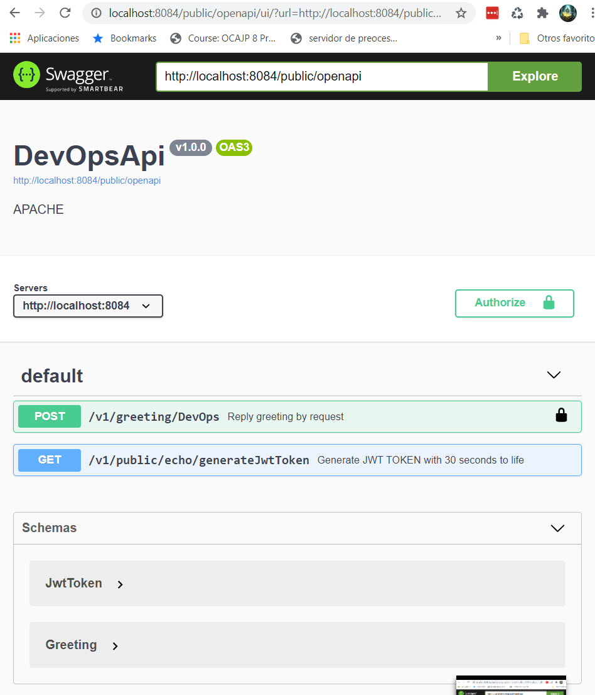
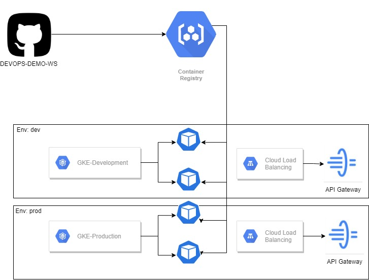

# devops-demo
Example de DevOps With Google Cloud

## Prerequisites

##### **devops-demo-ws**


|  Requirements                     | Version |Installation|
| ------- | --------------------------------- |-----------------|
|  Java | 8 |  [LINK](https://www.oracle.com/java/technologies/javase/javase-jdk8-downloads.html)|
| Maven | 3 |  [LINK](https://maven.apache.org/install.html) |
| Git | any version |  [LINK]( https://git-scm.com/book/en/v2/Getting-Started-Installing-Git) |
|Docker| any version| [LINK](https://docs.docker.com/engine/install/) |


#####  **Infrastructure as Code (IaC)**

|  Requirements                     | Version |Installation|
| ------- | --------------------------------- |-----------------|
| Terraform | V0.14.10 or mayor| [LINK](https://www.terraform.io/downloads.html)|
|SDK Google Cloud (gcloud)| 334.0.0| [LINK](https://cloud.google.com/sdk?hl=en)|
|Command Line Interface of kubernetes(kubectl) |v1.1 or mayor| [LINK](https://kubernetes.io/es/docs/tasks/tools/install-kubectl/)|

## Run the Rest API
For run the microservice, execute:

```bash
mvn clean install
java -jar target/*.jar
```
Additionally, the API rest was configured with OpenAPI spec 2.0, and you can test the Rest API  in the next URL:

- http://localhost:8084/public/openapi/ui 



## Static Analysis Test

To perform this test, SonarQube Cloud was used and the results can be accessed by: https://sonarcloud.io/dashboard?id=devops-demo-ws

**Note:** SonarCloud only executes analysis with java 11 or mayor and PowerMock work well with Java 9 or minor, for that reason, the coverage of code, not was published because of existing problems with the java 11 ([GitHub Issue](https://github.com/powermock/powermock/issues/1061)), however, you can execute the coverage test with the command locally:

```bash
mvn clean org.jacoco:jacoco-maven-plugin:prepare-agent install
```


## Integration Testing

For make integration testing, you can use the next endpoint:

|  Environment          | URL|
| ------- | --------------------------------- |
| Production | [LINK](http://85.19.231.35.bc.googleusercontent.com/public/openapi/ui/?url=http://85.19.231.35.bc.googleusercontent.com/public/openapi&oauth2RedirectUrl=http://85.19.231.35.bc.googleusercontent.com/public/openapi/oauth2-redirect.html) |
| Development | [LINK](http://141.93.222.35.bc.googleusercontent.com/public/openapi/ui/?url=http://141.93.222.35.bc.googleusercontent.com/public/openapi&oauth2RedirectUrl=http://141.93.222.35.bc.googleusercontent.com/public/openapi/oauth2-redirect.html) |


## Architecture

The project manages two models:
##### **devops-demo-ws**

The architecture consideration was "Onion Architecture", where manage the next layers:

|  Layer                     | Description|
| ------- | --------------------------------- |
| Service | Handle the logical business |
| Model | Handle stereotypes used in the requests and responses of web services |
| Configuration | Handle the configuration for API Layer |
| Enumeration | Handle the constants of the project |
| Producer | Additional layer for manage javax.enterprise.inject.Produces |
| Api | Handle the endpoint and additional classes for filter tokens or request methods |
| Util | Handle utility classes for the project |


#####  **Infrastructure as code (IaC)**

The folder structure to manage is:


```bash
IaC/
└── gke
    ├── cluster
    │   ├── kubeconfig-dev
    │   ├── kubeconfig-prod
    │   ├── main
    │   │   ├── main.tf
    │   │   ├── outputs.tf
    │   │   └── variables.tf
    │   ├── main.tf
    │   ├── terraform.tfstate
    │   └── terraform.tfstate.backup
    └── deployment
        ├── api-gateway
        │   ├── devops-dev.yaml
        │   ├── devops-prod.yaml
        │   ├── main
        │   │   ├── api_gateway.tf
        │   │   └── variables.tf
        │   ├── main.tf
        │   └── terraform.tfstate
        └── pods
            ├── main.tf
            ├── terraform.tfstate
            ├── terraform.tfstate.backup
            └── variables.tf


```

Where each folder manages the next considerations:

|  Folder                     | Description|
| ------- | --------------------------------- |
| GKE | Handle the IaC for Google Kubernetes Engine |
| Cluster | Handle the code for generating many clusters with a specific environment: Development (dev), Staging (staging), Production, etc. |
| Deployment | Handle the code for generating pods and an API Gateway for each cluster environment. |


# CI/CD

## Continuous Integration

The global solution manages the next stages:

|  Stage                     | Description|
| ------- | --------------------------------- |
| Build | Manage the task for build de project |
| Test | Manage the task for executing coverage test and static analysis of code with SonarQube |

## Continuous Deployment and Delivery

The global solution manages the next stage:

|  Stage                     | Description|
| ------- | --------------------------------- |
| Deploy | Manage the task for push the docker image to Google Container Register and update of pods with a new docker image. Depending on the branch, the stage can execute automatically (**Continuous Deployment**) or manually (**Continuous Delivery**) |

# Versioning

The global project use **Semantic Versioning and Structure Specification** publish by IETF in the link: https://tools.ietf.org/id/draft-claise-semver-00.html.


# Operation flow

The project uses the  [GitHub Flow](https://guides.github.com/introduction/flow/)  for the operation flow in GitHub Actions.


# Project workflow

### Considerations

When the developer push to the development branch on GitHub, the project must configure the flow for CI/CD with GitHub Actions.

- Before executing de deploy stage, IaC must be executed in the cloud.

For executing the cluster generation, execute the next commands:

```bash
cd IaC/gke/cluster
terraform init #Initialize and download terraform deependencies
terraform plan # generate a review of the plan to execute in google cloud
terraform apply -auto-approve # Apply the plan in Google Cloud
```


For executing the generation of pods into the cluster:

```bash
cd IaC/gke/deployment/pods
terraform init #Initialize and download terraform deependencies
terraform plan # generate a review of the plan to execute in google cloud
terraform apply -auto-approve # Apply the plan in Google Cloud
```


For executing the generation of API Gateway, you must provide an OpenApi specification, for these actions, you can download the spec: using the: **Integration Testing** section.

There are two examples for the environment of OpenAPI spec for the API Gateway in the folder **api-gateway**.

The commands for implementing the API Gateway are:

```bash
cd IaC/gke/deployment/api-gateway
terraform init #Initialize and download terraform deependencies
terraform plan # generate a review of the plan to execute in google cloud
terraform apply -auto-approve # Apply the plan in Google Cloud
```


The endpoints published for the API Gateway are:

|  Environment          | URL |
| ------- | --------------------------------- |
| Development | https://gw-dev-5b0q9by8.uc.gateway.dev |
| Production | https://gw-prod-5b0q9by8.ue.gateway.dev |

##### Publish Methods 

|  Method                     | Request Type |Description|
| ------- | --------------------------------- |--|
| ${URL_API_GW_ENV}/generateJwtToken | GET |Get JWT token for DevOps API Token|
| ${URL_API_GW_ENV}/DevOps | POST | Execute the request with the parameters example provided |

Once executed, the pipeline must be executed for run the next flow in Google Cloud: 



##### Flow

1. The developer executes the CI/CD in the project, later, GitHub Action deploys a docker image into Google Container Registry as **devops-demo-ws-${env}** and tag the docker image with the version of the project.
2. Execute the delete of pods the defined environment cluster into the GitHub Action for regenerate the pod with the last version published in Google Container Registry.
3. The changes are published and can be tested

Thanks for your attention
Fernando.
